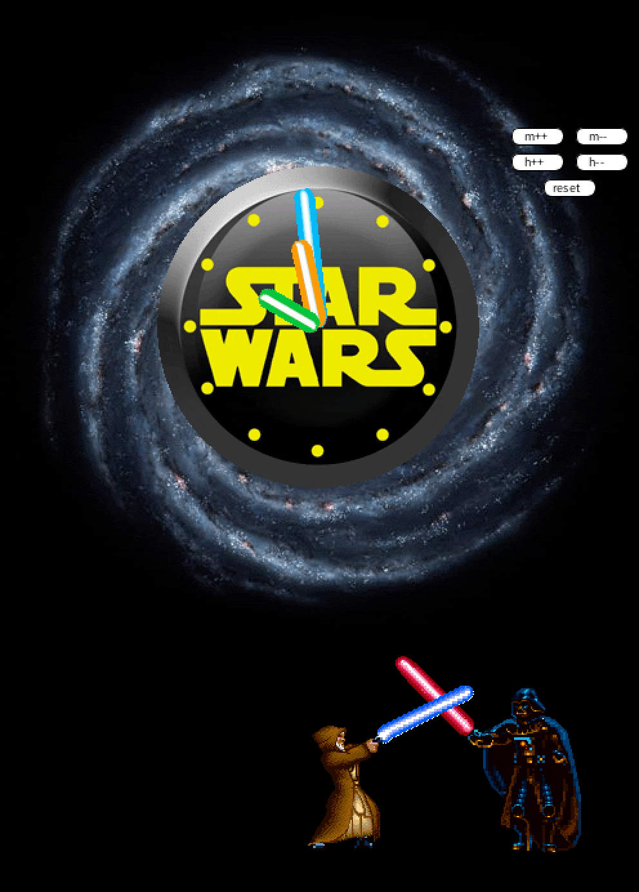

# Star Wars Cuckoo Clock

This is a fun project written in Processing that simulates a Star Wars cuckoo clock. The clock reproduces an animation for each hour of the day.

## Requirements

To run and build the code, you will need to have the following software installed:

- Processing 3 or later: Download and install Processing from the official website https://processing.org/download/.

## How to Run

To run the project, follow these steps:

1. Download the source code from the project's GitHub repository: https://github.com/delco97/star-wars-cuckoo-clock.
2. Open the `Cucu.pde` file in Processing.
3. Click the "Run" button in the Processing IDE.
4. The Star Wars cuckoo clock will start running and play the appropriate animation for the current hour.

## How to Build

To build the project as an executable file that can be run on other machines, follow these steps:

1. Open the `Cucu.pde` file in Processing.
2. Click the "File" menu and select "Export".
3. Choose the appropriate export settings for your target platform (Windows, Mac, or Linux).
4. Click the "Export" button.
5. The executable file will be saved to the chosen location on your computer.
6. Copy resources required by the executable file to the same folder.

## Contributing

This project was created just for fun and experimenting with Processing, but if you want to contribute to it, feel free to fork the repository and make your changes. You can then submit a pull request with your changes for review.

## License

This project is licensed under the MIT License - see the `LICENSE` file for details.